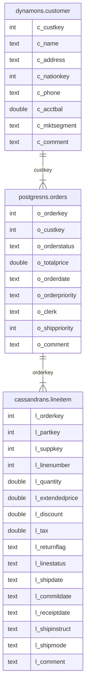

# Run Analytical Queries on Sample Data by Using ScalarDB Analytics with Spark

This tutorial describes how to run analytical queries on sample data by using ScalarDB Analytics with Spark. The source code is available at https://github.com/scalar-labs/scalardb-samples/scalardb-analytics-spark-sample.

:::warning

You must have a commercial license to use ScalarDB Analytics with Spark. If you need a commercial license, please [contact us](https://scalar-labs.com/contact_us/).

:::

## What you can do in this sample application

This sample tutorial shows how you can run interactive analysis in the Spark shell by using ScalarDB Analytics with Spark. In particular, you'll learn how to run the following two types of queries:

- Read data and calculate summaries.
- Join tables that span multiple storages.

## Prerequisites

- [Docker](https://www.docker.com/get-started/) 20.10 or later with [Docker Compose](https://docs.docker.com/compose/install/) V2 or later

## Set up ScalarDB Analytics with Spark

### Clone the ScalarDB samples repository

Open **Terminal**, then clone the ScalarDB samples repository by running the following command:

```console
$ git clone https://github.com/scalar-labs/scalardb-samples
```

Then, go to the directory that contains the sample application by running the following command:

```console
$ cd scalardb-samples/scalardb-analytics-spark-sample
```

### Add your license certificate to the sample directory

Copy your license certificate (`cert.pem`) to the sample directory by running the following command, replacing `<PATH_TO_YOUR_LICENSE>` with the path to your license:

```console
$ cp /<PATH_TO_YOUR_LICENSE>/cert.pem cert.pem
```
:::warning

If you need a commercial license, please [contact us](https://scalar-labs.com/contact_us/).

:::

### Set up the sample underlying databases in ScalarDB

To set up the sample underlying databases for ScalarDB, run the following command:

```console
$ docker compose up -d --wait
```

This command starts three services locally for PostgreSQL, Cassandra, and DynamoDB.

Then, set up the sample databases on those services by running the following command:

```console
$ docker compose run --rm sample-data-loader
```

This command creates `postgresns`, `cassandrans`, and `dynamons` namespaces, which are mapped to the local PostgreSQL, Cassandra, and DyanmoDB services respectively, creates `postgresns.orders`, `cassandrans.lineitem`, and `dynamons.customer` tables, and loads the sample data into those tables. For details about the table schema, see [Schema details](#schema-details).

### Set up ScalarDB Analytics with Spark in the Spark shell

To launch the Spark shell, run the following command:

```console
$ docker compose run --rm spark-shell
```

As you can see in `docker-compose.yml`, this command executes the `spark-shell` command with the `--packages com.scalar-labs:scalardb-analytics-spark-<SPARK_VERSION>_<SCALA_VERSION>:<SCALARDB_ANALYTICS_WITH_SPARK_VERSION>` option. With this option, `spark-shell` automatically downloads ScalarDB Analytics with Spark from the Maven Central Repository and add it to the classpath of `spark-shell`.

In the Spark shell console, you can set up ScalarDB Analytics with Spark by running the following commands:

```console
scala> import com.scalar.db.analytics.spark.implicits._
scala> spark.setupScalarDbAnalytics(
           | configPath = "/etc/scalardb.properties", 
           | namespaces = Set("postgresns", "cassandrans", "dynamons"),
           | license = License.certPath("""{"your":"license", "key":"in", "json":"format"}""", "/etc/cert.pem")
           | )
````

:::warning

Remember that you must have copied your license certificate to the sample directory as described in [Add your license certificate to the sample directory](#add-your-license-certificate-to-the-sample-directory), since the license is referenced in the JSON string. 

If you need a commercial license, please [contact us](https://scalar-labs.com/contact_us/).

:::

Now, you should have tables for `postgresns.orders`, `cassandrans.lineitem`, and `dynamons.customer` on the Spark side that are equivalent to the tables in ScalarDB. For example:

```console
scala> sql("DESCRIBE postgresns.orders").show()
+---------------+---------+-------+
|       col_name|data_type|comment|
+---------------+---------+-------+
|     o_orderkey|      int|   NULL|
|      o_custkey|      int|   NULL|
|  o_orderstatus|   string|   NULL|
|   o_totalprice|   double|   NULL|
|    o_orderdate|   string|   NULL|
|o_orderpriority|   string|   NULL|
|        o_clerk|   string|   NULL|
| o_shippriority|      int|   NULL|
|      o_comment|   string|   NULL|
+---------------+---------+-------+
```

## Run analytical queries

The following sections describe how to read data, calculate summaries, and join tables that span multiple storages.

### Read data and calculate summaries

You can run a query that reads data from `cassandrans.lineitem`, with the actual data stored in Cassandra, and calculates several summaries of the ordered line items by aggregating the data.

To run the query, run the following command in the Spark shell console:

```scala
scala> sql("""
     SELECT
             l_returnflag,
             l_linestatus,
             sum(l_quantity) AS sum_qty,
             sum(l_extendedprice) AS sum_base_price,
             sum(l_extendedprice * (1 - l_discount)) AS sum_disc_price,
             sum(l_extendedprice * (1 - l_discount) * (1 + l_tax)) AS sum_charge,
             avg(l_quantity) AS avg_qty,
             avg(l_extendedprice) AS avg_price,
             avg(l_discount) AS avg_disc,
             count(*) AS count_order
     FROM
             cassandrans.lineitem
     WHERE
             to_date(l_shipdate, 'yyyy-MM-dd') <= date '1998-12-01' - 3
     GROUP BY
             l_returnflag,
             l_linestatus
     ORDER BY
             l_returnflag,
             l_linestatus;
     """).show()
```

You should see the following output:

```console
+------------+------------+-------+------------------+------------------+------------------+------------------+------------------+-------------------+-----------+
|l_returnflag|l_linestatus|sum_qty|    sum_base_price|    sum_disc_price|        sum_charge|           avg_qty|         avg_price|           avg_disc|count_order|
+------------+------------+-------+------------------+------------------+------------------+------------------+------------------+-------------------+-----------+
|           A|           F|   1519|2374824.6560278563|1387364.2207725341|1962763.4654265852|26.649122807017545|41663.590456629056|0.41501802923479575|         57|
|           N|           F|     98| 146371.2295412012| 85593.96776336085|121041.55837332775|32.666666666666664|48790.409847067065|0.40984706454007996|          3|
|           N|           O|   5374| 8007373.247086477| 4685647.785126835| 6624210.945739046|24.427272727272726| 36397.15112312035| 0.4147594809559689|        220|
|           R|           F|   1461|2190869.9676265526|1284178.4378283697|1814151.2807494882|25.189655172413794| 37773.62013149229|0.41323493790730753|         58|
+------------+------------+-------+------------------+------------------+------------------+------------------+------------------+-------------------+-----------+
```

### Join tables that span multiple databases

You can also run a query to join tables that are connected to the three back-end databases and calculate the unshipped orders with the highest revenue on a particular date.

To run the query, run the following command in the Spark shell console:

```scala
scala> sql("""
     SELECT
       l_orderkey,
       sum(l_extendedprice * (1 - l_discount)) AS revenue,
       o_orderdate,
       o_shippriority
     FROM
       dynamons.customer,
       postgresns.orders,
       cassandrans.lineitem
     WHERE
       c_mktsegment = 'AUTOMOBILE'
       AND c_custkey = o_custkey
       AND l_orderkey = o_orderkey
       AND o_orderdate < '1995-03-15'
       AND l_shipdate > '1995-03-15'
     GROUP BY
       l_orderkey,
       o_orderdate,
       o_shippriority
     ORDER BY
       revenue DESC,
       o_orderdate,
       l_orderkey
     LIMIT 10;
     """).show()
```

You should see the following output:

```console
+----------+------------------+-----------+--------------+
|l_orderkey|           revenue|o_orderdate|o_shippriority|
+----------+------------------+-----------+--------------+
|   1071617|128186.99915996166| 1995-03-10|             0|
|   1959075| 33104.51278645416| 1994-12-23|             0|
|    430243|19476.115819260962| 1994-12-24|             0|
+----------+------------------+-----------+--------------+
```

:::note

You can also run any arbitrary query that Apache Spark and Spark SQL support on the imported tables in this sample tutorial. Since ScalarDB Analytics with Spark supports all queries that Spark SQL supports, you can use not only join, aggregation, filtering, and ordering as shown in the example but also the window function, lateral join, and various analytical operations.

To see which types of queries Spark SQL supports, see the [Spark SQL documentation](https://spark.apache.org/docs/latest/sql-ref.html).

:::

## Stop the sample application

To stop the sample application, stop the Docker container by running the following command:

```console
$ docker compose down
```

## Reference - Schema details

In this sample tutorial, you have tables with the following schema in the underlying databases of ScalarDB:



For reference, this diagram shows the following:

- `dynamons`, `postgresns`, and `cassandrans`. Namespaces that are mapped to the back-end storages of DynamoDB, PostgreSQL, and Cassandra, respectively.
- `dynamons.customer`. A table that represents information about customers. This table includes attributes like customer key, name, address, phone number, and account balance.
- `postgresns.orders`. A table that contains information about orders that customers have placed. This table includes attributes like order key, customer key, order status, order date, and order priority.
- `cassandrans.lineitem`. A table that represents line items associated with orders. This table includes attributes such as order key, part key, supplier key, quantity, price, and shipping date.
