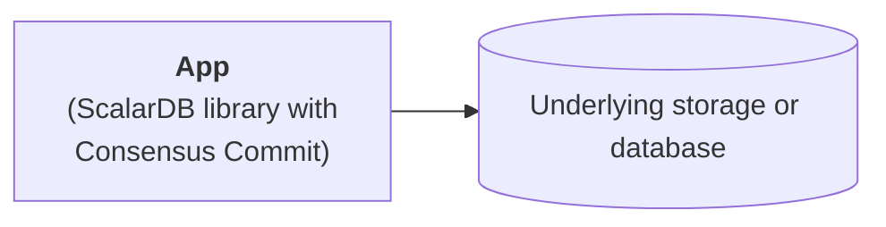
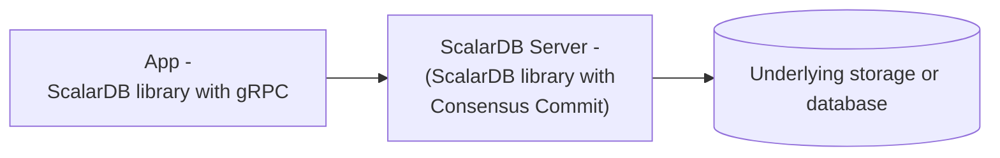

# ScalarDB Configurations

import Tabs from '@theme/Tabs';
import TabItem from '@theme/TabItem';

This page describes the available configurations for ScalarDB.

## ScalarDB client configurations

ScalarDB provides its own transaction protocol called Consensus Commit. You can use the Consensus Commit protocol directly through the ScalarDB client library or through the gRPC-based ScalarDB Server, which is a daemon process that manages ScalarDB transactions.

### Use Consensus Commit directly

Consensus Commit is the default transaction manager type in ScalarDB. To use the Consensus Commit transaction manager, add the following to the ScalarDB properties file:

```properties
scalar.db.transaction_manager=consensus-commit
```

:::note

If you don't specify the `scalar.db.transaction_manager` property, `consensus-commit` will be the default value.

:::

#### Basic configurations

The following basic configurations are available for the Consensus Commit transaction manager:

| Name                                                 | Description                                                                                                                                                                                                                                                                                                                                                                                             | Default       |
|-------------------------------------------------------|---------------------------------------------------------------------------------------------------------------------------------------------------------------------------------------------------------------------------------------------------------------------------------------------------------------------------------------------------------------------------------------------------------|---------------|
| `scalar.db.transaction_manager`                       | `consensus-commit` should be specified.                                                                                                                                                                                                                                                                                                                                                                 | -             |
| `scalar.db.consensus_commit.isolation_level`          | Isolation level used for Consensus Commit. Either `SNAPSHOT` or `SERIALIZABLE` can be specified.                                                                                                                                                                                                                                                                                                        | `SNAPSHOT`    |
| `scalar.db.consensus_commit.serializable_strategy`    | Serializable strategy used for Consensus Commit. Either `EXTRA_READ` or `EXTRA_WRITE` can be specified. If `SNAPSHOT` is specified in the property `scalar.db.consensus_commit.isolation_level`, this configuration will be ignored.                                                                                                                                                                                       | `EXTRA_READ`  |
| `scalar.db.consensus_commit.coordinator.namespace`    | Namespace name of Coordinator tables.                                                                                                                                                                                                                                                                                                                                                                   | `coordinator` |

#### Performance-related configurations

The following performance-related configurations are available for the Consensus Commit transaction manager:

| Name                                                     | Description                                                                    | Default                                                           |
|-----------------------------------------------------------|--------------------------------------------------------------------------------|-------------------------------------------------------------------|
| `scalar.db.consensus_commit.parallel_executor_count`      | Number of executors (threads) for parallel execution.              | `128`                                                             |
| `scalar.db.consensus_commit.parallel_preparation.enabled` | Whether or not the preparation phase is executed in parallel.                  | `true`                                                            |
| `scalar.db.consensus_commit.parallel_validation.enabled`  | Whether or not the validation phase (in `EXTRA_READ`) is executed in parallel. | The value of `scalar.db.consensus_commit.parallel_commit.enabled` |
| `scalar.db.consensus_commit.parallel_commit.enabled`      | Whether or not the commit phase is executed in parallel.                       | `true`                                                            |
| `scalar.db.consensus_commit.parallel_rollback.enabled`    | Whether or not the rollback phase is executed in parallel.                     | The value of `scalar.db.consensus_commit.parallel_commit.enabled` |
| `scalar.db.consensus_commit.async_commit.enabled`         | Whether or not the commit phase is executed asynchronously.                    | `false`                                                           |
| `scalar.db.consensus_commit.async_rollback.enabled`       | Whether or not the rollback phase is executed asynchronously.                  | The value of `scalar.db.consensus_commit.async_commit.enabled`    |

#### Underlying storage or database configurations

Consensus Commit has a storage abstraction layer and supports multiple underlying storages. You can specify the storage implementation by using the `scalar.db.storage` property.

Select a database to see the configurations available for each storage.

<Tabs groupId="databases" queryString>
  <TabItem value="Cassandra" label="Cassandra" default>
    The following configurations are available for Cassandra:

    | Name                                    | Description                                                           | Default    |
    |-----------------------------------------|-----------------------------------------------------------------------|------------|
    | `scalar.db.storage`                     | `cassandra` must be specified.                                        | -          |
    | `scalar.db.contact_points`              | Comma-separated contact points.                                       |            |
    | `scalar.db.contact_port`                | Port number for all the contact points.                               |            |
    | `scalar.db.username`                    | Username to access the database.                                      |            |
    | `scalar.db.password`                    | Password to access the database.                                      |            |
  </TabItem>
  <TabItem value="CosmosDB_for_NoSQL" label="CosmosDB for NoSQL">
    The following configurations are available for CosmosDB for NoSQL:

    | Name                                       | Description                                                                                              | Default    |
    |--------------------------------------------|----------------------------------------------------------------------------------------------------------|------------|
    | `scalar.db.storage`                        | `cosmos` must be specified.                                                                              | -          |
    | `scalar.db.contact_points`                 | Azure Cosmos DB for NoSQL endpoint with which ScalarDB should communicate.                               |            |
    | `scalar.db.password`                       | Either a master or read-only key used to perform authentication for accessing Azure Cosmos DB for NoSQL. |            |
    | `scalar.db.cosmos.table_metadata.database` | Database name for the table metadata used for ScalarDB.                                                  | `scalardb` |
  </TabItem>
  <TabItem value="DynamoDB" label="DynamoDB">
    The following configurations are available for DynamoDB:

    | Name                                        | Description                                                                                                                                                                                                                                                 | Default    |
    |---------------------------------------------|-------------------------------------------------------------------------------------------------------------------------------------------------------------------------------------------------------------------------------------------------------------|------------|
    | `scalar.db.storage`                         | `dynamo` must be specified.                                                                                                                                                                                                                                 | -          |
    | `scalar.db.contact_points`                  | AWS region with which ScalarDB should communicate (e.g., `us-east-1`).                                                                                                                                                                                      |            |
    | `scalar.db.username`                        | AWS access key used to identify the user interacting with AWS.                                                                                                                                                                                              |            |
    | `scalar.db.password`                        | AWS secret access key used to authenticate the user interacting with AWS.                                                                                                                                                                                   |            |
    | `scalar.db.dynamo.endpoint_override`        | Amazon DynamoDB endpoint with which ScalarDB should communicate. This is primarily used for testing with a local instance instead of an AWS service.                                                                                                        |            |
    | `scalar.db.dynamo.table_metadata.namespace` | Namespace name for the table metadata used for ScalarDB.                                                                                                                                                                                                    | `scalardb` |
    | `scalar.db.dynamo.namespace.prefix`         | Prefix for the user namespaces and metadata namespace names. Since AWS requires having unique tables names in a single AWS region, this is useful if you want to use multiple ScalarDB environments (development, production, etc.) in a single AWS region. |            |
  </TabItem>
  <TabItem value="JDBC_databases" label="JDBC databases">
    The following configurations are available for JDBC databases:

    | Name                                                      | Description                                                                                                                                                                  | Default                      |
    |-----------------------------------------------------------|------------------------------------------------------------------------------------------------------------------------------------------------------------------------------|------------------------------|
    | `scalar.db.storage`                                       | `jdbc` must be specified.                                                                                                                                                    | -                            |
    | `scalar.db.contact_points`                                | JDBC connection URL.                                                                                                                                                         |                              |
    | `scalar.db.username`                                      | Username to access the database.                                                                                                                                             |                              |
    | `scalar.db.password`                                      | Password to access the database.                                                                                                                                             |                              |
    | `scalar.db.jdbc.connection_pool.min_idle`                 | Minimum number of idle connections in the connection pool.                                                                                                                   | `20`                         |
    | `scalar.db.jdbc.connection_pool.max_idle`                 | Maximum number of connections that can remain idle in the connection pool.                                                                                                   | `50`                         |
    | `scalar.db.jdbc.connection_pool.max_total`                | Maximum total number of idle and borrowed connections that can be active at the same time for the connection pool. Use a negative value for no limit.                        | `100`                        |
    | `scalar.db.jdbc.prepared_statements_pool.enabled`         | Setting this property to `true` enables prepared-statement pooling.                                                                                                          | `false`                      |
    | `scalar.db.jdbc.prepared_statements_pool.max_open`        | Maximum number of open statements that can be allocated from the statement pool at the same time. Use a negative value for no limit.                                         | `-1`                         |
    | `scalar.db.jdbc.isolation_level`                          | Isolation level for JDBC. `READ_UNCOMMITTED`, `READ_COMMITTED`, `REPEATABLE_READ`, or `SERIALIZABLE` can be specified.                                                       | Underlying-database specific |
    | `scalar.db.jdbc.table_metadata.schema`                    | Schema name for the table metadata used for ScalarDB.                                                                                                                        | `scalardb`                   |
    | `scalar.db.jdbc.table_metadata.connection_pool.min_idle`  | Minimum number of idle connections in the connection pool for the table metadata.                                                                                            | `5`                          |
    | `scalar.db.jdbc.table_metadata.connection_pool.max_idle`  | Maximum number of connections that can remain idle in the connection pool for the table metadata.                                                                            | `10`                         |
    | `scalar.db.jdbc.table_metadata.connection_pool.max_total` | Maximum total number of idle and borrowed connections that can be active at the same time for the connection pool for the table metadata. Use a negative value for no limit. | `25`                         |
    | `scalar.db.jdbc.admin.connection_pool.min_idle`           | Minimum number of idle connections in the connection pool for admin.                                                                                                         | `5`                          |
    | `scalar.db.jdbc.admin.connection_pool.max_idle`           | Maximum number of connections that can remain idle in the connection pool for admin.                                                                                         | `10`                         |
    | `scalar.db.jdbc.admin.connection_pool.max_total`          | Maximum total number of idle and borrowed connections that can be active at the same time for the connection pool for admin. Use a negative value for no limit.              | `25`                         |
  </TabItem>
</Tabs>

##### Multi-storage support

ScalarDB supports using multiple storage implementations simultaneously. You can use multiple storages by specifying `multi-storage` as the value for the `scalar.db.storage` property.

For details about using multiple storages, see [Multi-Storage Transactions](multi-storage-transactions.mdx).

### Use Consensus Commit through ScalarDB Server

[ScalarDB Server](scalardb-server.mdx) is a standalone server that provides a gRPC interface to ScalarDB. To interact with ScalarDB Server, you must add the following to the ScalarDB properties file:

```properties
scalar.db.transaction_manager=grpc
```

The following configurations are available for the gRPC transaction manager for ScalarDB Server:

| Name                                       | Description                                                 | Default                 |
|--------------------------------------------|-------------------------------------------------------------|-------------------------|
| `scalar.db.transaction_manager`            | `grpc` should be specified.                                 | -                       |
| `scalar.db.contact_points`                 | ScalarDB Server host.                                       |                         |
| `scalar.db.contact_port`                   | Port number for ScalarDB Server.                            | `60051`                 |
| `scalar.db.grpc.deadline_duration_millis`  | The deadline duration for gRPC connections in milliseconds. | `60000` (60 seconds)    |

For details about ScalarDB Server, see [ScalarDB Server](scalardb-server.mdx).

## ScalarDB Server configurations

[ScalarDB Server](scalardb-server.mdx) is a standalone server that provides a gRPC interface to ScalarDB. This section explains ScalarDB Server configurations.

In addition to the [configurations when using Consensus Commit directly](#use-consensus-commit-directly) and [other ScalarDB configurations](#other-scalardb-configurations), the following configurations are available for ScalarDB Server:

| Name                                              | Description                                                                                      | Default                 |
|---------------------------------------------------|--------------------------------------------------------------------------------------------------|-------------------------|
| `scalar.db.server.port`                           | Port number for ScalarDB Server.                                                                 | `60051`                 |
| `scalar.db.server.prometheus_exporter_port`       | Prometheus exporter port. Prometheus exporter will not be started if a negative number is given. | `8080`                  |

For details about ScalarDB Server, see [ScalarDB Server](scalardb-server.mdx).

## Other ScalarDB configurations

The following are additional configurations available for ScalarDB:

| Name                                                             | Description                                                                                                                                                                                                       | Default              |
|------------------------------------------------------------------|-------------------------------------------------------------------------------------------------------------------------------------------------------------------------------------------------------------------|----------------------|
| `scalar.db.metadata.cache_expiration_time_secs`                  | ScalarDB has a metadata cache to reduce the number of requests to the database. This setting specifies the expiration time of the cache in seconds.                                                               | `-1` (no expiration) |

## Configuration examples

This section provides some configuration examples.

### Configuration example #1 - App and database



In this example configuration, the app (ScalarDB library with Consensus Commit) connects to an underlying storage or database (in this case, Cassandra) directly.

:::warning

This configuration exists only for development purposes and isn’t suitable for a production environment. This is because the app needs to implement the [Scalar Admin](https://github.com/scalar-labs/scalar-admin) interface to take transactionally consistent backups for ScalarDB, which requires additional configurations.

:::

The following is an example of the configuration for connecting the app to the underlying database through ScalarDB:

```properties
# Transaction manager implementation.
scalar.db.transaction_manager=consensus-commit

# Storage implementation.
scalar.db.storage=cassandra

# Comma-separated contact points.
scalar.db.contact_points=<CASSANDRA_HOST>

# Credential information to access the database.
scalar.db.username=<USERNAME>
scalar.db.password=<PASSWORD>
```

### Configuration example #2 - App, ScalarDB Server, and database



In this example configuration, the app (ScalarDB library with gRPC) connects to an underlying storage or database (in this case, Cassandra) through ScalarDB Server.

:::note

This configuration is acceptable for production use because ScalarDB Server implements the [Scalar Admin](https://github.com/scalar-labs/scalar-admin) interface, which enables you to take transactionally consistent backups for ScalarDB by pausing ScalarDB Server.

:::

The following is an example of the configuration for connecting the app to the underlying database through ScalarDB Server:

```properties
# Transaction manager implementation.
scalar.db.transaction_manager=grpc

# ScalarDB Server host.
scalar.db.contact_points=<SCALARDB_SERVER_HOST>

# ScalarDB Server port.
scalar.db.contact_port=<SCALARDB_SERVER_PORT>
```
